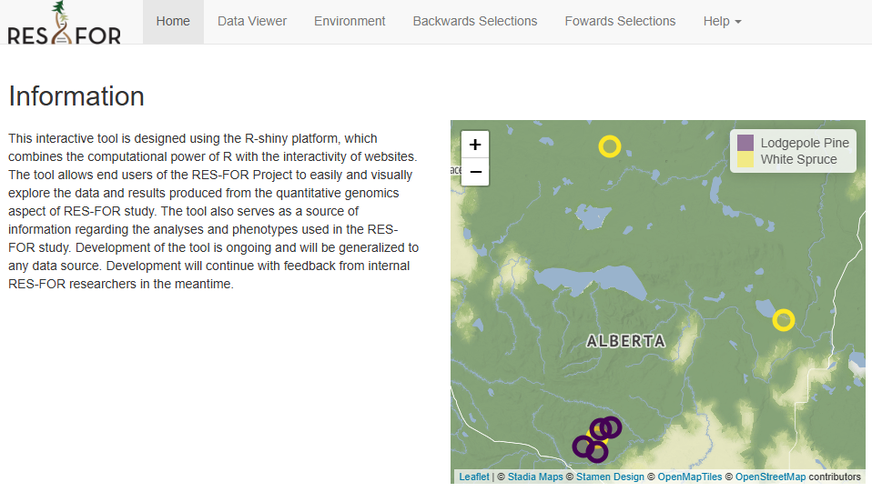

# RESFOR Selection Tool

Selection tool for genomic analyses.

> ✨ **Live Demo**: https://bff-afirms.shinyapps.io/RESFOR/



## Install

1. Clone the github repository.

    ```bash
    git clone https://github.com/BFF-AFIRMS/RESFOR_Shiny
    cd RESFOR_Shiny
    ```

1. Build the docker image.

    ```bash
    docker build -t bff-afirms/resfor-shiny:latest .
    ```

1. Start the shiny server.

    ```bash
    docker run -p 3838:3838 bff-afirms/resfor-shiny:latest
    ```

    > Open http://localhost:3838 to see the app!

## Develop

1. Build the development docker image.

    ```bash
    docker build -t bff-afirms/resfor-shiny:dev -f Dockerfile.dev .st .
    ```

1. Start the development server.

    ```bash
    docker run -p 8787:8787 -e PASSWORD=password bff-afirms/resfor-shiny:dev
    ```

    > Open http://localhost:8787 to access Rstudio, login with username: `rstudio`, password: `password`
